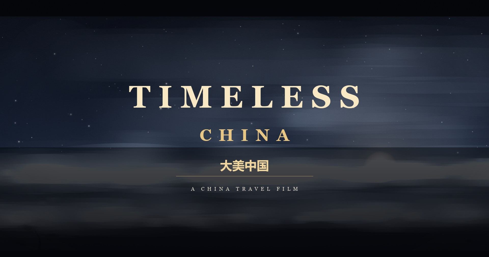
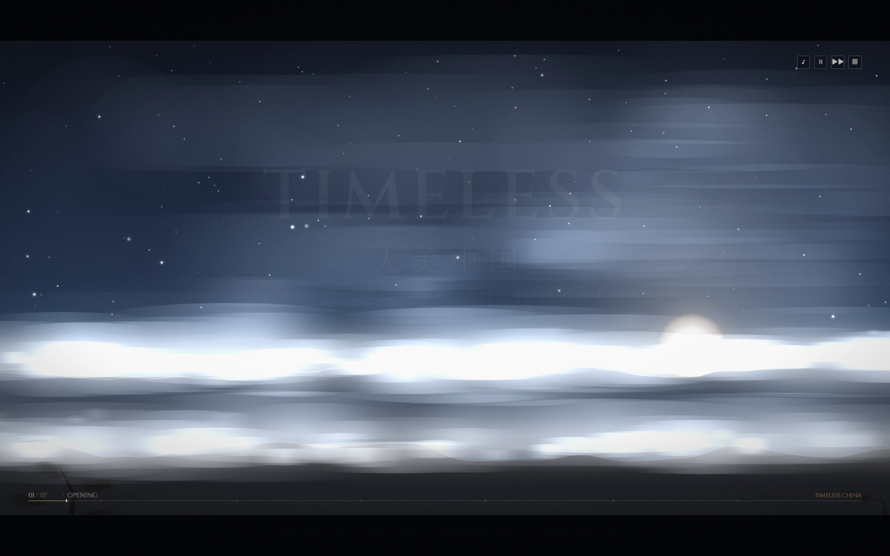
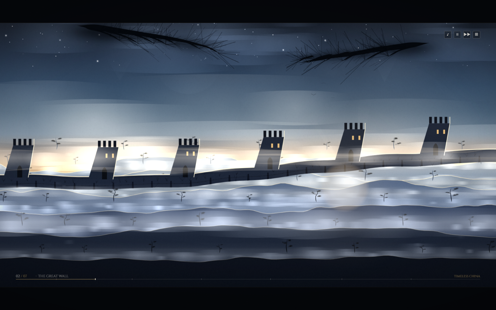
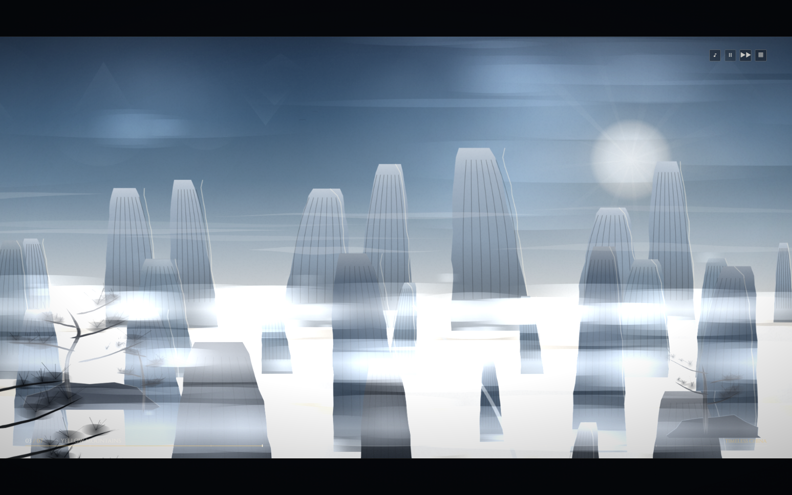
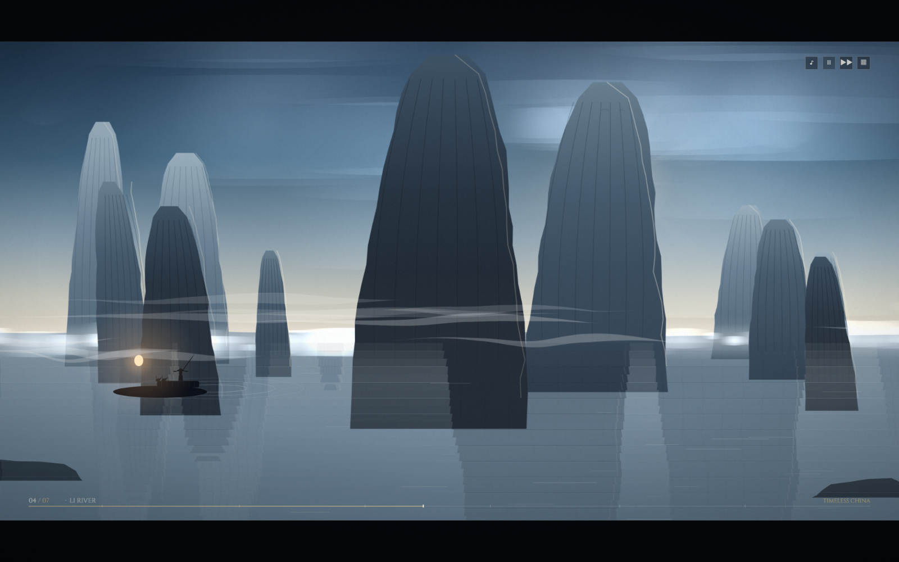
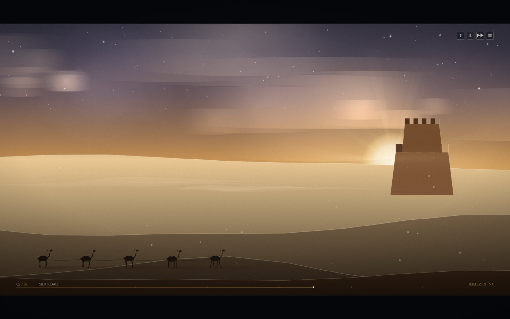
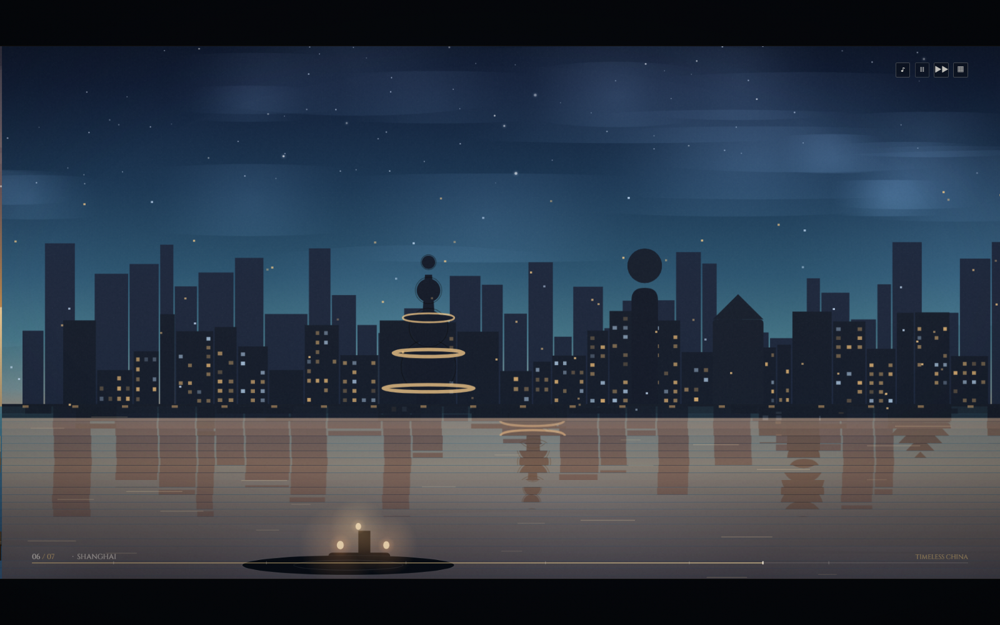
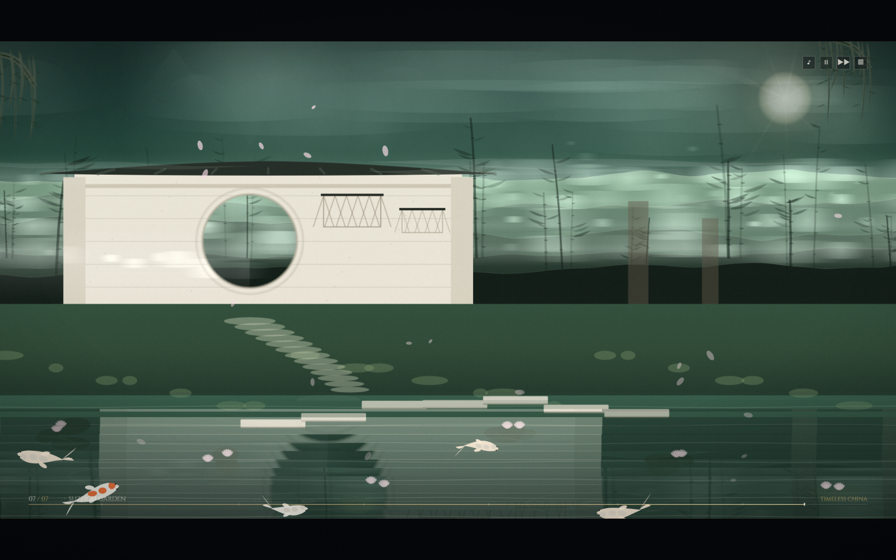

<div align="center">

# Timeless China

### Four minutes. Seven wonders. One HTML file.

A cinematic journey through China's greatest landscapes — the Great Wall at first light, Huangshan above a sea of cloud, the Li River, the Dunhuang dunes, Shanghai at blue hour, a Suzhou garden — drawn live in your browser, frame by frame, note by note.

**[▶ Watch the film](https://daoge96.github.io/timeless-china/)**

[](https://daoge96.github.io/timeless-china/)


[](LICENSE)

[](https://daoge96.github.io/timeless-china/)


</div>

---

## This is not a video

- There is **no video file**. No `.mp4`, no `.webm`, no frame sequence sitting on a server.

- There is **no image asset**. No `.png`, no `.jpg`, no sprite sheet, no texture, no logo file.

- There is **no audio file**. Not one `.mp3`. The entire score is synthesized live, as you watch it.

- There is **no library, no build step, nothing to install**. One `index.html`, ~165 KB, and that is the whole film: engine, seven scenes, music, interface, controls.

- Every frame is drawn from scratch at 60 fps on a single 2D `<canvas>` — about 12,600 of them, start to finish.

Open it and it plays. Unplug the internet and it plays. Double-click it from your desktop and it plays.

### By the numbers

| Fact | Value |
|------|-------|
| Runtime | ~3.5 minutes, one continuous piece |
| Scenes | 7, hand-composed |
| Deliverable | 1 file, ~165 KB, 0 dependencies |
| Assets | 0 images · 0 audio files |
| Rendering | Canvas 2D, `requestAnimationFrame` |
| Score | Web Audio API, fully generative |

## Watch it

**[https://daoge96.github.io/timeless-china/](https://daoge96.github.io/timeless-china/)** — sound on, press `F` for fullscreen, lights off.

**It starts by itself.** No play button, no click: open it and the opening scene is already moving, a title card fades in, and the film plays straight through all seven scenes in about three and a half minutes. Sound begins on your first click or keypress — browsers require one gesture before audio — and the film waits for nothing else.

Or run it locally — two commands, no server, no install:

```bash
git clone https://github.com/daoge96/timeless-china.git
cd timeless-china && open index.html     # macOS: open · Windows: start index.html · Linux: xdg-open index.html
```

Double-clicking `index.html` works exactly the same. It is a plain file, not a web app: no server, no bundle, no `npm install`, no first-run compile.

Want a specific moment instead of the whole film? Deep links are in the Controls section below — `?act=5&t=12` drops you into Shanghai twelve seconds in.

### Embed it

It is one self-contained page, so it also drops into any `<iframe>`:

```html
<iframe src="https://daoge96.github.io/timeless-china/?mute=1&nohud=1"
        width="1280" height="720" style="border:0" allowfullscreen></iframe>
```

## What you'll see

Seven scenes, ~3.5 minutes, a continuous pass through ink, light and water.

| # | Scene | What happens |
|---|-------|--------------|
| 1 | **Opening** · 序章<br> | Ink-wash cloud sea at dawn. Ridges surface out of wet black ink, the sun lifts through the haze, the title settles in gold. |
| 2 | **The Great Wall** · 万里长城<br> | Sunrise along the wall: watchtowers riding the ridge line, a sea of cloud breaking against the stone, light shafts through the valley haze, birds crossing the sun. |
| 3 | **Yellow Mountains** · 黄山<br> | Huangshan granite spires rising out of a drifting cloud sea, the Guest-Greeting Pine bent over the cliff edge, mist pouring between the peaks. |
| 4 | **Li River, Guilin** · 漓江<br> | Karst towers mirrored in still water, a bamboo raft sliding through its own reflection — a lantern at the bow, cormorants perched, ripples spreading behind. |
| 5 | **Dunhuang & the Silk Road** · 丝绸之路<br> | Dunes at dusk, a camel caravan crossing them, a lone beacon tower, dust hanging in the air, stars coming out overhead. |
| 6 | **Shanghai at Blue Hour** · 上海<br> | The Bund facing Pudong as the sky turns cobalt — window lights switch on in waves across the skyline and smear down the Huangpu. |
| 7 | **Suzhou Classical Garden** · 苏州园林<br> | Moon gate, lattice windows, a zig-zag bridge over a koi pond, petals drifting across water that never stops moving. |

Full 3×3 contact sheet: **[screenshots/montage.png](screenshots/montage.png)**

Poster frame: [screenshots/poster.png](screenshots/poster.png)

### The score

Under the picture runs a continuous pentatonic score that transposes scene by scene — bright and open at dawn, low and wide under the dunes, glassy and reflective on the Bund. It is performed, not played back: plucked strings for the guzheng-like voice, a bowed reed-like lead, a slow pad, and wind and water beds that follow the landscape you are looking at.

## Controls

Nothing is required — the film autoplays. These are for steering it.

| Input | Action |
|-------|--------|
| Click / tap anywhere | First click: unlock sound. After that: skip to the next scene |
| `N` or `→` | Next scene |
| `←` or `↑` | Previous scene |
| `Space` | Pause / resume |
| `P` | Pause / resume |
| `S` | Scene picker — live thumbnails of all seven scenes, click one to jump |
| `M` | Sound on / off |
| `F` | Fullscreen |
| `Esc` | Close the scene picker |

The scene picker (`S`) renders its thumbnails from the real engine, so what you click is what you get.

The film is also deep-linkable, which makes a single moment easy to share:

| URL parameter | Effect |
|---------------|--------|
| `?act=0` … `?act=6` | Start on a chosen scene |
| `?t=SECONDS` | Start at a timestamp inside the timeline |
| `?pause=1` | Load frozen on the first frame |
| `?mute=1` | Load with sound off |
| `?dpr=0.5` … `?dpr=3` | Force the render scale |
| `?nohud=1` | Hide every interface element — pure picture |

```
https://daoge96.github.io/timeless-china/?act=5&t=12                 # Shanghai, twelve seconds in
https://daoge96.github.io/timeless-china/?act=2&pause=1&nohud=1      # a Huangshan wallpaper
```

## How it works

- **A hand-written canvas 2D engine.** No WebGL, no framework, no renderer library — a small scene graph, a layer compositor and a timeline clock, written from the ground up for this one film.

- **Deterministic by construction.** A seeded `mulberry32` PRNG plus FBM value noise generate every ridge, dune, karst tower and cloud bank, so the film is identical on every run, on every machine, in every browser. There is not a single `Math.random()` in the file.

- **Bake once, blit forever.** Static geometry is rendered once into offscreen canvases at boot, then composited per frame with parallax offsets — dense imagery, tiny per-frame cost.

- **A custom ink brush.** Tapered, variable-width strokes with dry-brush bristle streaks, plus atmospheric haze layers, mist bands and cloud-bank generators that give the whole film its wet-paper feel.

- **A synthesized score, not a loop.** Karplus–Strong plucked strings for the guzheng-like voice, a detuned-saw + bandpass + LFO lead for the erhu-like line, a slow pad, filtered-noise wind and water beds, and a convolution reverb built from a procedurally generated impulse response.

- **Music locked to picture.** The score transposes per scene and is scheduled off the same timeline clock that drives the animation — pause the film and the music pauses *with* it, in sync, exactly where it left off.

## Performance

Measured in headless Chrome at 1440×900:

| Metric | Result |
|--------|--------|
| Median frame time | **~17 ms** (vsync-bound, ~60 fps) |
| 95th-percentile frame time | **~19 ms** |
| Console errors / warnings | **0 / 0** |
| Failed network requests | **0** |

Rendering is adaptive: if the average frame time slips, the film lowers its own internal render resolution in small steps and raises it back as soon as there is headroom. Smooth motion first, pixel count second.

The same budget holds across viewports, all three verified in the QA run:

| Viewport | Result |
|----------|--------|
| 1920×1080 desktop | within budget, no errors |
| 1366×768 laptop | within budget, no errors |
| 390×844 phone | within budget, no errors |

## Compatibility

- Chrome, Edge, Safari and Firefox — current versions, desktop and mobile.

- Desktops, laptops, tablets and phones; the stage, HUD and type scale themselves to the viewport.

- Works straight from `file://`, from a static host, from GitHub Pages, from a USB stick.

- Works with Wi-Fi switched off — nothing the film renders or plays is ever fetched.

- No CDN in the critical path: it boots, animates and scores itself with zero network, so there is no regional blocking and no cold-start latency. It loads as fast from Shanghai as from Berlin.

- No cookies, no analytics, no tracking, no storage. Open it, watch it, close it.

- The only optional extra is a `<link>` to a decorative display serif. If it never arrives — offline, blocked, slow — system serifs take over and the film carries on unchanged.

## Repo layout

```
timeless-china/
├── index.html                 # the entire film — engine, scenes, score, UI (~165 KB)
├── README.md
├── LICENSE                    # MIT
├── .github/
│   ├── assets/social-preview.png
│   └── workflows/pages.yml    # publishes the live demo to GitHub Pages
├── screenshots/               # hero, per-scene stills, montage, poster, demo.gif
└── dev/                       # optional QA harness — delete it and the film still runs
    ├── qa.mjs                 # 57 assertions covering the whole film
    ├── cdp.mjs                # headless-Chrome driver over the DevTools Protocol
    ├── build.mjs              # concatenates dev/src/*.js into index.html
    └── src/                   # the readable source the single file is built from
```

`dev/` is a development convenience only. The published film has no relationship with it — `index.html` stands completely alone.

## Running the checks

```bash
node dev/qa.mjs
```

Needs Node and a local Chrome (set `CHROME_PATH` if it is not in the default location).

The harness boots the film headlessly and asserts 57 things: that it starts with 7 registered scenes and a 3.5–5 minute timeline, that every scene renders real colour and tonal range, that frames change over time without flickering, that click / next / pause / mute do what they claim, that the score starts after a gesture, that the film still runs with the network disabled, that it holds its frame budget at three viewports (1920×1080, 1366×768, 390×844), and that `index.html` contains no comments, no external script or stylesheet, and no stray `Math.random()`.

## License

MIT © [daoge96](https://github.com/daoge96) — see [LICENSE](LICENSE). Take it apart, learn from it, ship your own.

## 中文简介

一行 HTML，四分钟，七处山河：水墨云海、长城日出、黄山、漓江、敦煌、上海蓝调、苏州园林。

全部画面由 Canvas 逐帧绘制，配乐由 Web Audio 实时合成——没有视频、没有图片、没有音频文件，双击即可离线播放。

愿你看完，想去看看。
